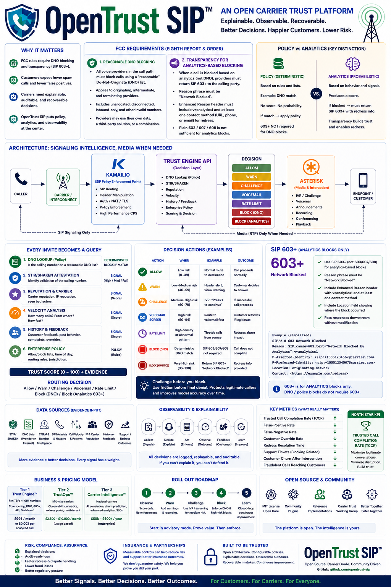

# OpenTrust SIP

**Open-source Carrier Trust Engine for ITSPs, CLECs, SIP operators, and enterprise voice providers.**

Make call-blocking and fraud-prevention decisions explainable, observable, auditable, and recoverable.

[!CAUTION]
This is not "AI blocks calls." The engine recommends. The carrier controls policy. Every decision must be explainable and replayable.

## Infographic



## Architecture

```
INVITE
  ↓
Kamailio (SIP policy enforcement)
  ↓
Trust Engine API
  ↓
Decision
  ↓
ALLOW / WARN / CHALLENGE / VOICEMAIL / BLOCK
  ↓
Asterisk (only when media interaction needed)
```

- **Kamailio** — SIP policy enforcement point
- **Trust API** — Policy + evidence + analytics scoring engine
- **Asterisk** — IVR challenge / voicemail screening (media-only)
- **Gigapipe** — production observability sink for traces, metrics, logs, and customer-impact investigations
- **NLP Assistant** — read-only operations assistant using local templates, Ollama, OpenAI-compatible APIs, or Vultr Serverless Inference

## Decision Types

| Decision | Action |
|---|---|
| `ALLOW` | Route normally |
| `WARN` | Route with customer-visible warning |
| `CHALLENGE` | Send to Asterisk IVR / screening |
| `VOICEMAIL` | Send to voicemail screening |
| `RATE_LIMIT` | Throttle source or campaign |
| `BLOCK_DNO` | Deterministic policy block (DNO) |
| `BLOCK_ANALYTICS` | Analytics-based block with notification |

## Policy vs Analytics

| DNO (Policy) | Fraud Scoring (Analytics) |
|---|---|
| Deterministic | Probabilistic |
| Explicit block/allow | Risk score + confidence |
| Immediate enforcement | Recommendation only |

Do not mix them. DNO match = deterministic policy. High risk score = probabilistic analytics.

## Rollout Plan

| Phase | Action |
|---|---|
| 1 — Observe | Score calls, no enforcement |
| 2 — Warn | Dashboards, warnings, reporting |
| 3 — Challenge | Asterisk IVR for medium-risk |
| 4 — Block | DNO blocks + analytics blocks separated |
| 5 — Closed-Loop | Feedback + redress → improved scoring |

## Repo Structure

```
opentrust-sip/
  README.md
  SEED.md
  docs/
    architecture.md
    fcc-notes.md
    dno.md
    sip-603-plus.md
    observability.md
    deployment.md
    how-it-works.md
    gigapipe.md
    nlp-assistant.md
    compliance-readiness.md
    customer-itsp-readiness.md
  kamailio/
    route-examples/
    trust-api.cfg
  asterisk/
    ivr-challenge/
    voicemail-screening/
  trust-api/
    app/
    tests/
    Dockerfile
  database/
    schema.sql
    migrations/
  dashboards/
    grafana/
  examples/
    docker-compose.yml
    sample-calls.json
```

## Quick Start

```bash
# Start the full stack
docker compose -f examples/docker-compose.yml up -d

# Check Trust API health
curl http://localhost:8000/health

# Score a call
curl -X POST http://localhost:8000/v1/decision \
  -H 'Content-Type: application/json' \
  -d '{
    "call_id": "abc123",
    "from_number": "+15551234567",
    "to_number": "+15559876543",
    "source_ip": "203.0.113.10",
    "source_carrier": "ExampleCarrier",
    "stir_shaken": "A",
    "user_agent": "sip-client",
    "timestamp": "2026-07-06T12:00:00Z"
  }'
```

## Production Observability With Gigapipe

```bash
export GIGAPIPE_OTLP_ENDPOINT="https://YOUR-GIGAPIPE-OTLP-ENDPOINT:4317"
export GIGAPIPE_API_KEY="YOUR-GIGAPIPE-API-KEY"

docker compose \
  -f examples/docker-compose.yml \
  -f examples/docker-compose.gigapipe.yml \
  up -d
```

See `docs/gigapipe.md` for customer-impact telemetry, correlation fields, and Gigapipe setup.

## Talk To The System

The NLP assistant is read-only by default and answers from stored audit evidence.

```bash
curl -X POST http://localhost:8000/v1/nlp/query \
  -H 'Content-Type: application/json' \
  -H 'X-API-Key: dev-api-key' \
  -d '{"query":"Why was call abc123 blocked?","call_id":"abc123"}'
```

Set `NLP_PROVIDER=local`, `ollama`, `openai`, or `vultr` to choose the backend. See `docs/nlp-assistant.md`.

For compliance and investor diligence posture, see `docs/compliance-readiness.md`.

## How It Works

For a business and technical walkthrough of how OpenTrust SIP works and how both ITSPs and customers win, see `docs/how-it-works.md`.

## Grafana Dashboards

Optional Grafana dashboards are provisioned under `dashboards/grafana/provisioning/dashboards/` for local development, NOC screens, and self-hosted operations.

The operator pack includes overview, policy-vs-analytics, redress/compliance, API health, and NLP safety dashboards.

Gigapipe remains the recommended production observability and audit investigation layer.

## Success Metrics

Optimize for **trusted call completion**, not "calls blocked."

- Trusted Call Completion Rate
- False-positive rate / False-negative rate
- Customer override rate
- Redress resolution time
- Support tickets caused by blocking
- Customer churn after intervention
- Fraudulent calls reaching customers
- Legitimate calls completed without friction

## License

MIT
